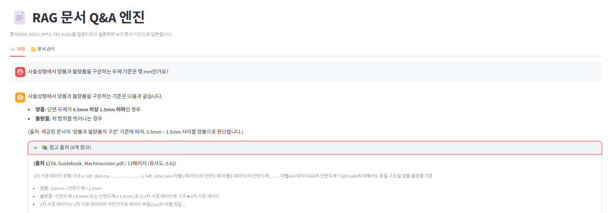
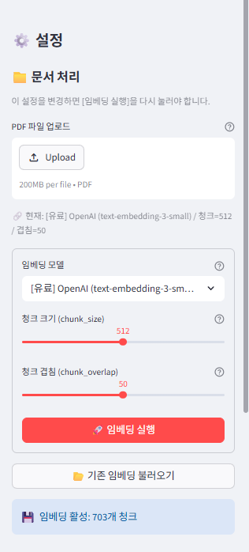
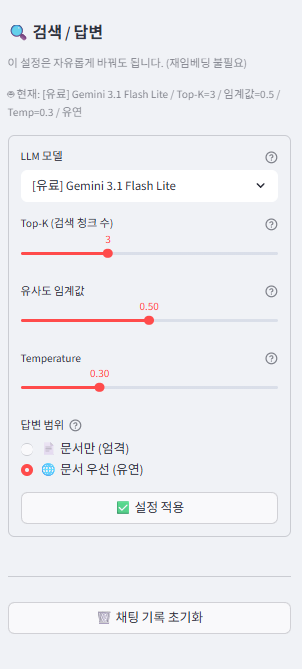
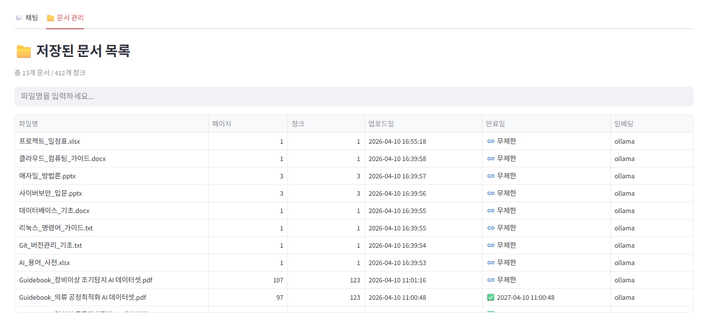

# 📄 RAG 문서 Q&A 엔진

PDF 문서를 업로드하면 AI가 내용을 이해하고 자연어 질문에 답변하는 **RAG(Retrieval-Augmented Generation) 기반 검색 엔진**

`Python 3.12` · `LangChain` · `ChromaDB` · `Ollama` · `Streamlit`

---

## 📋 목차

1. [프로젝트 개요](#-프로젝트-개요)
2. [실행 화면](#-실행-화면)
3. [핵심 성과](#-핵심-성과)
4. [기술 스택](#-기술-스택)
5. [프로젝트 구조](#-프로젝트-구조)
6. [RAG 파이프라인](#-rag-파이프라인)
7. [실험 결과](#-실험-결과)
8. [최종 추천 설정](#-최종-추천-설정)
9. [한계점 및 개선 방안](#-한계점-및-개선-방안)
10. [배운 점](#-배운-점)

---

## 🎯 프로젝트 개요

| 항목 | 내용 |
|------|------|
| 개발 시점 | 2026.04 |
| 개발 인원 | 1인 단독 개발 |
| 개발 환경 | AWS EC2 (Ubuntu 24.04) + 로컬 GPU 서버 (RTX 5090 32GB) |
| 테스트 데이터 | KAMP 제조AI 가이드북 PDF 5종 (머신비전 · OCR · 열처리 · 의류 · 장비이상) |
| 평가 질문 | 도메인 질문 5개 + 문서 외 질문 1개 + 무의미 입력 1개 = **총 7개** |

### 핵심 목표

- RAG 파이프라인 전체 흐름(PDF 파싱 → 청킹 → 임베딩 → 벡터 검색 → LLM 응답 생성) 직접 구현
- 청킹 크기 / 임베딩 모델 / LLM 3축 정량 비교 실험을 통한 최적 설정 도출
- **한국어 제조 도메인 RAG 성능 최적화**

---

## 🖥 실행 화면



*머신비전 도메인 질문에 대한 RAG 답변 — 답변 본문, 출처(파일명·페이지), 코사인 유사도(0.62)까지 함께 표시. 본 화면의 질문은 [실험 결과 §5-1 ~ §5-3](#-실험-결과)의 ① 머신비전 평가 항목과 동일.*

---

## 🏆 핵심 성과

> 🎯 **이 프로젝트의 핵심 발견**
> "비싼 API = 좋은 성능"은 한국어 제조 도메인에서는 거짓이다.
> OpenAI 유료 임베딩(`text-embedding-3-large`, $0.13/1M)이 머신비전 문서에서 **유사도 0.00으로 완전 실패**한 반면,
> 무료 로컬 모델 BGE-M3 → Qwen3 Embedding 8B로 교체하자 **정답률 85% → 100%, 청크 수 1/3 축소**.
> 변수 통제 → 정량 측정 → 가설 검증 사이클을 7 질문 × 4 임베딩 모델 × 3 청킹 크기로 직접 실증.

| 항목 | Before | After |
|------|--------|-------|
| 한국어 도메인 정답률 | 6/7 (85%) | **7/7 (100%)** |
| 청크 수 (동일 문서 기준) | 1,257개 | **400개 (1/3 축소)** |
| 임베딩 비용 | OpenAI 유료 API | **Ollama 로컬 모델 (무료)** |
| 데이터 외부 전송 | API 호출로 발생 | **외부 전송 없음 (보안성↑)** |

---

## 🛠 기술 스택

| 구분 | 기술 | 역할 |
|------|------|------|
| **언어** | Python 3.12 | 전체 개발 |
| **프레임워크** | LangChain | RAG 파이프라인 구성 |
| **임베딩 (API)** | OpenAI text-embedding-3-small | 비교 실험용 |
| **임베딩 (Ollama)** | **Qwen3 Embedding 8B** ⭐ | 한국어 임베딩 (최종 채택) |
| **벡터 DB** | ChromaDB | 임베딩 저장 및 코사인 유사도 검색 |
| **LLM (API)** | Gemini / GPT / Claude (Haiku 4.5) | 비교 실험용 |
| **LLM (Ollama)** | **Gemma 4 31B** ⭐ | 로컬 답변 생성 (최종 채택) |
| **로컬 모델 관리** | Ollama | 임베딩/LLM 모델 로드·실행·메모리 관리 |
| **문서 파싱** | pdfplumber, PyPDF2, python-docx | PDF·DOCX·PPTX·TXT·XLSX 멀티포맷 |
| **UI** | Streamlit | 웹 인터페이스 |
| **인프라** | AWS EC2 (Ubuntu 24.04) | 서버 운영 |

---

## 📁 프로젝트 구조

```
rag-qa-engine/
├── app.py                    # Streamlit UI (메인 애플리케이션)
├── modules/
│   ├── __init__.py
│   ├── parser.py             # 문서 → 텍스트 추출
│   ├── chunker.py            # 텍스트 → 청크 분할
│   ├── embedder.py           # 청크 → 벡터 변환 + ChromaDB 저장
│   ├── retriever.py          # 질문 → 유사 청크 검색
│   └── generator.py          # 검색 결과 → LLM 답변 생성
├── data/pdfs/                # 문서 파일 저장
├── chroma_db/                # ChromaDB 벡터 데이터
├── docs/screenshots/         # README 이미지
├── requirements.txt
├── .env                      # API 키 (Git 제외)
└── README.md
```

---

## 🔄 RAG 파이프라인

```
문서 업로드 (PDF / DOCX / PPTX / TXT / XLSX)
       ↓
[1. 파싱]  형식별 텍스트 추출 (pdfplumber, python-docx 등)
       ↓
[2. 해시]  SHA-256 파일 해시 계산 → 중복 체크
       ↓
[3. 청킹]  텍스트를 청크 단위로 분할 (고정 크기 1024 + 겹침 50)
       ↓
[4. 임베딩]  청크를 벡터로 변환 (Qwen3 Embedding 8B)
       ↓
[5. 저장]  ChromaDB에 벡터 + 메타데이터 저장
       ↓
사용자 질문 입력 (2000자 이내)
       ↓
[6. 검색]  질문 벡터화 → Top-K 유사 청크 검색 (임계값 0.5)
       ↓
[7. 생성]  검색 청크 + 질문 → LLM 답변 생성 (Gemma 4 31B)
       ↓
답변 + 출처 표시 (파일명 / 페이지 / 유사도)
```

### 하이퍼파라미터 실시간 조정 UI

모든 실험(§5-1 ~ §5-4)은 아래 사이드바 UI에서 진행. 임베딩 모델, 청크 크기, Top-K, 임계값, 답변 모드를 코드 수정 없이 즉시 변경 가능.

| 임베딩 설정 | 검색 / 답변 설정 |
|:---:|:---:|
|  |  |
| *임베딩 모델 / 청크 크기 / 청크 겹침* <br> *(실험 §5-1, §5-2, §5-3)* | *LLM 모델 / Top-K / 유사도 임계값 /* <br> *Temperature / 답변 범위 (엄격·유연)* |

### 추가 구현 기능

- **답변 모드 선택:** 엄격 모드(문서만) / 유연 모드(AI 지식 보충)
- **문서 CRUD:** 해시 기반 중복 방지, 단위 추가/삭제, 전체 초기화
- **문서 TTL:** 유효기간 설정, 만료 자동 삭제
- **임베딩 모델 보호:** 기존 DB와 다른 모델 사용 시 자동 거부
- **입력 제한:** 2000자 초과 질문 차단
- **인젝션 방어:** 프롬프트 인젝션 방지 문구 적용



*13개 문서 / 412 청크 운영 화면 — 파일별 페이지·청크 수, 업로드일, **만료일(TTL)**, 임베딩 모델 표시. 만료된 문서는 자동 삭제, 임베딩 모델이 다른 문서 추가 시 자동 거부됨.*

---

## 📊 실험 결과

> **3축(청킹 크기 · 임베딩 모델 · LLM) 정량 비교 실험으로 한국어 제조 도메인 RAG 최적 설정 도출**
> 평가 데이터: KAMP 제조AI 가이드북 PDF 5종 (총 381 페이지) · 평가 질문 7개 (도메인 5 + 거부 테스트 2)

---

### 5-1. 청킹 크기별 비교

> **설정:** OpenAI `text-embedding-3-small` / `Gemini 1.5 Flash Lite` / Top-K=10 · 임계값 0.5
> 괄호 안 숫자 = 코사인 유사도

| 질문 | 256 | 512 | 1024 |
|------|:---:|:---:|:---:|
| ① 머신비전 (두께 기준) | ✗ | ✗ | ✗ |
| ② OCR (알고리즘/성공률) | ✓ (0.72) | ✗ | ✓ (0.61) |
| ③ 열처리 (베이지안 신경망) | ✓ (0.71) | ✓ (0.67) | ✓ (0.64) |
| ④ 의류 (유전 알고리즘) | ✓ (0.62) | ✓ (0.63) | ✓ (0.63) |
| ⑤ 장비이상 (데이터/모델) | ✓ (0.53) | ✓ (0.55) | ✓ (0.53) |
| ⑥ 문서 외 질문 (정확 거부) | ✓ | ✓ | ✓ |
| ⑦ 무의미 입력 (정확 거부) | ✓ | ✓ | ✓ |
| **합계** | **6/7** | **5/7** | **6/7** |
| **청크 수** | **1,257개** | 703개 | **400개** |

**결론: 1024 채택**
- ① 머신비전 문서는 세 크기 모두 실패 → 청킹 크기 문제가 **아니라 임베딩 모델의 한국어 이해 부족**으로 진단 (5-2에서 검증)
- 256과 1024는 정답률 동일(6/7)이나 청크 수가 **1,257 → 400 (1/3 수준)** 으로 임베딩 비용·검색 속도에서 1024가 우위
- 512는 5/7로 가장 낮음 → 문맥이 중간에 잘리며 핵심 정보 분산이 원인으로 추정

---

### 5-2. 임베딩 모델 비교 (OpenAI vs BGE-M3)

> **설정:** 청크 1024 / Top-K=10 / `Gemini 1.5 Flash Lite` 고정
> 괄호 안 숫자 = 코사인 유사도 / 1M 토큰당 비용 표시

| 질문 | OpenAI small ($0.02) | OpenAI large ($0.13) | BGE-M3 (무료/로컬) |
|------|:---:|:---:|:---:|
| ① 머신비전 | ✗ (0.00) | ✗ (0.00) | ✓ (0.57) |
| ② OCR | ✓ (0.61) | ✓ (0.63) | ✓ (0.66) |
| ③ 열처리 | ✓ (0.64) | ✓ (0.59) | ✓ (0.68) |
| ④ 의류 | ✓ (0.63) | ✓ (0.59) | ✓ (0.66) |
| ⑤ 장비이상 | ✓ (0.53) | ✓ (0.52) | ✓ (0.61) |
| ⑥ 문서 외 | ✓ | ✓ | ✓ |
| ⑦ 무의미 | ✓ | ✓ | ✓ |
| **합계** | **6/7** | **6/7** | **7/7** |

**결론: BGE-M3로 임베딩 모델만 교체했더니 정답률이 85% → 100%로 상승**
- OpenAI small/large 모두 머신비전 문서에서 유사도 **0.00**으로 완전 실패 → 한국어 전문 용어 벡터화 한계
- **OpenAI large($0.13)가 small($0.02)보다 ③④번 유사도가 오히려 0.04~0.05 낮음** → 모델 크기·비용이 성능을 보장하지 않음을 정량 확인
- BGE-M3는 다국어(한국어 포함) 학습으로 모든 항목에서 가장 높은 유사도 기록

---

### 5-3. Qwen3 Embedding 추가 비교

> **설정:** 청크 1024 / Top-K=10 / `Gemma 4 31B` LLM
> 괄호 안 숫자 = 코사인 유사도

| 질문 | OpenAI small | BGE-M3 | Qwen3 Embedding 8B |
|------|:---:|:---:|:---:|
| ① 머신비전 | ✗ | ✓ (0.57) | ✓ (0.62) |
| ② OCR | ✓ (0.61) | ✓ (0.66) | ✓ (0.66) |
| ③ 열처리 | ✓ (0.64) | ✓ (0.68) | ✓ (0.74) |
| ④ 의류 | ✓ (0.63) | ✓ (0.66) | ✓ (0.71) |
| ⑤ 장비이상 | ✓ (0.53) | ✓ (0.61) | ✓ (0.67) |
| ⑥ 문서 외 | ✓ | ✓ | ✓ |
| ⑦ 무의미 | ✓ | ✓ | ✓ |
| **합계** | **6/7** | **7/7** | **7/7** |

**결론: Qwen3 Embedding 8B를 최종 채택 (BGE-M3 동일 7/7, 모든 항목 유사도 +0.05~0.06 우위)**
- 정답률은 BGE-M3와 동일하나 **모든 도메인 항목에서 유사도가 더 높음** (예: 열처리 0.68 → 0.74, 의류 0.66 → 0.71)
- 유사도 마진 확대 = **임계값 변동·문서 추가 시에도 검색 안정성 확보**
- Ollama 로컬 실행 → API 비용 0원, 데이터 외부 전송 없음(보안)

---

### 5-4. LLM 모델별 속도 비교 (Ollama vs GPT API)

> **검색 시간(질문 임베딩 + ChromaDB 코사인 검색) + LLM 응답 시간 (단위: 초)**
> 정확도는 두 모델 **모두 7/7로 동일**, 속도만 비교

| 질문 | Ollama 검색 | Ollama LLM | **Ollama 합계** | GPT 검색 | GPT LLM | **GPT 합계** | 차이 |
|------|:---:|:---:|:---:|:---:|:---:|:---:|:---:|
| ① 머신비전 | 2.45s | 19.56s | **22.0s** | 2.37s | 2.65s | **5.0s** | 4.4× |
| ② OCR | 5.71s | 21.00s | **26.7s** | 0.15s | 2.65s | **2.8s** | 9.5× |
| ③ 열처리 | 5.76s | 29.81s | **35.6s** | 0.16s | 3.87s | **4.0s** | 8.9× |
| ④ 의류 | 4.02s | 30.92s | **34.9s** | 0.17s | 2.24s | **2.4s** | 14.5× |
| ⑤ 장비이상 | 15.97s | 23.39s | **39.4s** | 0.16s | 1.95s | **2.1s** | 18.8× |
| ⑥ 문서 외 | 5.71s | 12.62s | **18.3s** | 0.15s | 0.84s | **1.0s** | 18.3× |
| ⑦ 무의미 | 5.66s | 12.26s | **17.9s** | 0.18s | 0.97s | **1.1s** | 16.3× |
| **평균** | **6.47s** | **21.37s** | **27.8s** | **0.48s** | **2.17s** | **2.6s** | **약 10.7×** |

**결론: 평균 응답 시간 약 10.7배 차이 — 원인 두 가지를 분리해서 진단**

| 시간 영역 | Ollama 평균 | GPT 평균 | 원인 |
|---|:---:|:---:|---|
| **검색 시간** | 6.47s | 0.48s (~13×) | **VRAM 모델 스왑** — Gemma 4 31B(추론 시 ~29GB) + Qwen3 임베딩 8B(4.7GB) 동시 상주 불가, 질문마다 `gemma4 언로드 → qwen3 로드 → 임베딩 → 언로드 → gemma4 재로드` 반복 (`journalctl -u ollama` 로그로 실증) |
| **LLM 응답 시간** | 21.37s | 2.17s (~10×) | **물리적 연산 능력 차이** — 로컬 RTX 5090 1장 단독 추론 vs 데이터센터 GPU 클러스터 + 텐서 병렬화 + 추론 엔진 최적화. 로컬 환경의 구조적 한계 |

> 💡 **트러블슈팅 시도:** `OLLAMA_MAX_LOADED_MODELS=2`, Flash Attention, `num_ctx` 축소 모두 실패 — 32GB VRAM 물리 한계는 넘을 수 없음을 실증.
> 임시 우회로 작은 LLM(`qwen3.5:9b`, 6.6GB)으로 교체하니 임베딩 호출이 5.8s → 0.13s (약 40배)로 단축되어 **모델 스왑이 검색 지연의 주범**임을 정량 검증.

---

## 🎯 최종 추천 설정

| 항목 | 설정 | 비고 |
|------|------|------|
| 임베딩 모델 | **Qwen3 Embedding 8B (Ollama)** | 무료, 한국어 최고 |
| 청킹 방식 | 고정 크기 1024 + 겹침 50 | 안정적, 빠름 |
| Top-K | 10 | |
| 유사도 임계값 | 0.5 | |
| LLM | **Gemma 4 31B (Ollama)** | 무료, 응답 품질 우수 |
| GPU 권장 | RTX 5090 (32GB VRAM) | |

---

## ⚠️ 한계점 및 개선 방안

### 현재 한계점

1. **표 데이터 임베딩 품질 저하**
   PDF 내 표 구조 데이터가 청크에 포함되면 임베딩 벡터가 노이즈 방향으로 치우침
2. **짧은 문서 검출 한계**
   1페이지 등 내용이 짧은 문서는 유사도가 낮아 임계값(0.5)에 걸리지 않거나 노이즈에 묻힘
3. **프롬프트 인젝션 한계**
   고도화된 인젝션 공격에 완벽한 방어 불가
4. **Ollama 모델 스왑**
   Gemma 4 31B(추론 시 약 29GB VRAM 점유) + Qwen3 임베딩 8B(4.7GB) 동시 상주 불가 → 매 질문마다 모델 스왑으로 검색 지연
5. **GPU 의존성**
   Ollama 로컬 모델은 고성능 GPU 필요 (VRAM 32GB 권장)

### 향후 개선 방안

| 우선순위 | 항목 | 설명 |
|:---:|------|------|
| **P1** | Reranker 도입 | Cross-encoder로 검색 결과 재정렬, 정확도 향상 |
| **P2** | 하이브리드 검색 | 벡터(의미) + BM25(키워드) 결합, 고유명사 검색 누락 방지 |
| **P3** | 멀티턴 대화 | 이전 질문 맥락을 기억하는 채팅 |

---

## 💡 배운 점

### 1. 임베딩 모델 선택이 핵심
처음에는 *"유료 API가 당연히 좋겠지"* 라는 막연한 생각으로 OpenAI 임베딩을 사용. 청킹 크기를 256/512/1024로 바꿔가며 실험해도 머신비전 문서 검색이 계속 실패했음. **원인은 임베딩 모델 자체에 있었고, BGE-M3로 교체하자 정답률이 85%에서 100%로 올랐음.** 이후 Qwen3 Embedding을 추가 비교한 결과, 모든 항목에서 BGE-M3보다도 높은 유사도를 기록. **"비싼 API = 좋은 성능"이 아님을 데이터로 증명한 것**이 가장 의미 있는 발견.

### 2. 로컬 AI의 현실적 한계 체감
완전 무료 로컬 환경 구축 시도. 그러나 RTX 5090(32GB) 한 장으로는 Gemma 4 31B(추론 시 ~29GB)와 임베딩 모델을 동시에 올릴 수 없었음. `journalctl`과 `nvidia-smi` 로그를 분석해 모델 스왑 현상을 실증. `OLLAMA_MAX_LOADED_MODELS=2` 등의 해결책을 시도했지만 물리적 VRAM 한계는 넘을 수 없었음. **GPU 메모리 관리와 모델 최적화에 대한 실무적 감각**을 얻음.

### 3. 실험 설계의 중요성
청킹 크기, 임베딩 모델, LLM 조합을 체계적으로 비교하면서 **변수를 하나씩 통제하고 결과를 정량적으로 측정하는 과정**이 딥러닝 학습의 본질과 동일하다는 것을 체감. 단순히 *"작동하는 코드"* 가 아니라 *"왜 이 설정이 최적인지"* 를 이해하는 과정을 배움.

---

*이 프로젝트는 AI 엔지니어로서의 첫 걸음이자, 실험과 데이터로 의사결정하는 사고방식을 체화한 시간이었다.*